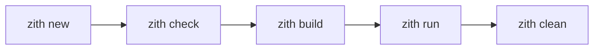

# Zith Documentation Refactoring Plan

## Executive Summary

This document outlines the complete refactoring of the Zith programming language documentation from a custom HTML/JS system to **Docusaurus v2+**, focusing on:

- **User Experience**: Clear navigation, smooth animations, centered content
- **Scalable Organization**: Two distinct sections (Beginner vs Technical)
- **Modern Aesthetics**: Dark blue theme, orange text, blue links/code
- **Long-term Maintainability**: Modular CSS/JS, automatic sidebars, category indexes

---

## 1. Proposed Docusaurus Folder Structure

```
/workspace/docs/                    # Docusaurus root
├── docusaurus.config.js            # Main configuration
├── sidebars.js                     # Automatic sidebar generation
├── package.json                    # Dependencies
├── src/
│   ├── css/                        # Modular CSS
│   │   ├── custom.css              # Main import file
│   │   ├── modules/
│   │   │   ├── base.css            # Variables, resets, typography
│   │   │   ├── layout.css          # Page structure, grid
│   │   │   ├── components.css      # Buttons, tables, callouts
│   │   │   ├── animations.css      # Entrance animations
│   │   │   ├── homepage.css        # Landing page styles
│   │   │   └── scrollbar.css       # Custom scrollbar
│   │   └── pages/
│   │       ├── _category_.json     # Category metadata
│   │       └── showcase.css        # Community showcase styles
│   ├── js/                         # Modular JavaScript
│   │   ├── utils/
│   │   │   ├── scroll-reset.js     # Auto scroll on navigation
│   │   │   └── animations.js       # Intersection observers
│   │   └── components/
│   │       └── copy-button.js      # Code block copy functionality
│   └── pages/                      # Static pages (non-docs)
│       ├── index.js                # Homepage (Landing)
│       ├── index.module.css        # Homepage-specific styles
│       └── community/
│           ├── index.js            # Community showcase index
│           └── [project].js        # Individual project pages
├── docs/                           # Documentation content
│   ├── intro/                      # 🟦 Initial/Main Section (Beginners)
│   │   ├── _category_.json         # Category config
│   │   ├── 01-overview.md          # What is Zith?
│   │   ├── 02-why-zith.md          # Why choose Zith for systems?
│   │   ├── 03-installation.md      # Installation guide
│   │   └── 04-quickstart.md        # First program
│   ├── technical/                  # 🟧 Technical Section (Advanced users)
│   │   ├── _category_.json
│   │   ├── cli/                    # CLI Reference
│   │   │   ├── _category_.json
│   │   │   ├── overview.md         # CLI Overview (auto-linked)
│   │   │   ├── check.md
│   │   │   ├── compile.md
│   │   │   ├── build.md
│   │   │   ├── run.md
│   │   │   ├── new.md
│   │   │   ├── clean.md
│   │   │   ├── repl.md
│   │   │   ├── fmt.md
│   │   │   └── flags.md
│   │   ├── language/               # Language Guide
│   │   │   ├── _category_.json
│   │   │   ├── overview.md
│   │   │   ├── syntax.md
│   │   │   ├── variables.md
│   │   │   ├── types.md
│   │   │   ├── control-flow.md
│   │   │   ├── functions.md
│   │   │   ├── memory.md
│   │   │   ├── errors.md
│   │   │   ├── modules.md
│   │   │   └── generics.md
│   │   ├── project/                # Project Configuration
│   │   │   ├── _category_.json
│   │   │   ├── overview.md
│   │   │   └── toml.md
│   │   ├── raw/                    # ⚠️ Raw & Unsafe (NEW - replaces "advanced")
│   │   │   ├── _category_.json
│   │   │   ├── overview.md
│   │   │   ├── how-to-use.md
│   │   │   ├── traits.md
│   │   │   ├── generics-deep.md
│   │   │   ├── metaprogramming.md
│   │   │   ├── macros.md
│   │   │   ├── data-structures.md
│   │   │   ├── unsafe.md           # NEW: Unsafe operations
│   │   │   └── raw-pointers.md     # NEW: Raw pointer manipulation
│   │   └── faq/                    # FAQ Section
│   │       ├── _category_.json
│   │       ├── overview.md
│   │       ├── philosophy.md
│   │       ├── security.md
│   │       ├── rust-comparison.md
│   │       └── use-cases.md
│   └── extras/                     # Additional resources
│       ├── _category_.json
│       ├── glossary.md
│       └── migration-guide.md
└── static/                         # Static assets
    ├── img/
    │   ├── logo.svg
    │   ├── favicon.ico
    │   └── og-image.png
    └── zith-logo-large.svg
```

---

## 2. Complete Sitemap

### 🟦 Section A: Beginner / Landing Zone

```
/                                   # Homepage (Landing)
├── /docs/intro/overview            # What is Zith?
├── /docs/intro/why-zith            # Why Zith for systems programming?
├── /docs/intro/installation        # Installation guide
└── /docs/intro/quickstart          # Write your first program
```

### 🟧 Section B: Technical Documentation

```
/docs/technical/cli/overview        # CLI Overview
├── /docs/technical/cli/check
├── /docs/technical/cli/compile
├── /docs/technical/cli/build
├── /docs/technical/cli/run
├── /docs/technical/cli/new
├── /docs/technical/cli/clean
├── /docs/technical/cli/repl
├── /docs/technical/cli/fmt
├── /docs/technical/cli/docs
└── /docs/technical/cli/flags

/docs/technical/language/overview   # Language Overview
├── /docs/technical/language/syntax
├── /docs/technical/language/variables
├── /docs/technical/language/types
├── /docs/technical/language/control-flow
├── /docs/technical/language/functions
├── /docs/technical/language/memory
├── /docs/technical/language/errors
├── /docs/technical/language/modules
└── /docs/technical/language/generics

/docs/technical/project/overview    # Project Configuration
└── /docs/technical/project/toml

/docs/technical/raw/overview        # Raw & Unsafe (NEW)
├── /docs/technical/raw/how-to-use
├── /docs/technical/raw/traits
├── /docs/technical/raw/generics-deep
├── /docs/technical/raw/metaprogramming
├── /docs/technical/raw/macros
├── /docs/technical/raw/data-structures
├── /docs/technical/raw/unsafe      # NEW: Unsafe blocks
└── /docs/technical/raw/raw-pointers # NEW: Raw pointers

/docs/technical/faq/overview        # FAQ Index
├── /docs/technical/faq/philosophy
├── /docs/technical/faq/security
├── /docs/technical/faq/rust-comparison
└── /docs/technical/faq/use-cases

/docs/technical/extras/glossary     # Glossary
└── /docs/technical/extras/migration-guide
```

### Special Pages (Non-Docs)

```
/community/                         # Community Showcase Index
/community/[project-slug]           # Individual project pages
```

---

## 3. Sidebar Organization

### Automatic Sidebar Generation Strategy

Docusaurus will use **automatic sidebar generation** based on folder structure and `_category_.json` files.

#### Example: `docs/technical/cli/_category_.json`
```json
{
  "label": "CLI Reference",
  "position": 2,
  "link": {
    "type": "generated-index",
    "title": "CLI Reference Overview",
    "slug": "/docs/technical/cli/overview"
  }
}
```

#### Generated Sidebar Structure:
```javascript
// sidebars.js (auto-generated from folder structure)
module.exports = {
  tutorialSidebar: [
    {
      type: 'autogenerated',
      dirName: '.', // Generate sidebar from the docs folder
    },
  ],
};
```

### Manual Sidebar with Categories (Recommended for Control)

```javascript
// sidebars.js
module.exports = {
  beginnerSidebar: [
    {
      type: 'category',
      label: 'Getting Started',
      link: {
        type: 'doc',
        id: 'intro/overview',
      },
      items: [
        'intro/overview',
        'intro/why-zith',
        'intro/installation',
        'intro/quickstart',
      ],
    },
  ],
  
  technicalSidebar: [
    {
      type: 'category',
      label: 'CLI Reference',
      link: {
        type: 'doc',
        id: 'technical/cli/overview',
      },
      items: [
        'technical/cli/overview',
        'technical/cli/check',
        'technical/cli/compile',
        'technical/cli/build',
        'technical/cli/run',
        'technical/cli/new',
        'technical/cli/clean',
        'technical/cli/repl',
        'technical/cli/fmt',
        'technical/cli/docs',
        'technical/cli/flags',
      ],
    },
    {
      type: 'category',
      label: 'Language Guide',
      link: {
        type: 'doc',
        id: 'technical/language/overview',
      },
      items: [
        'technical/language/overview',
        'technical/language/syntax',
        'technical/language/variables',
        'technical/language/types',
        'technical/language/control-flow',
        'technical/language/functions',
        'technical/language/memory',
        'technical/language/errors',
        'technical/language/modules',
        'technical/language/generics',
      ],
    },
    {
      type: 'category',
      label: 'Project Configuration',
      link: {
        type: 'doc',
        id: 'technical/project/overview',
      },
      items: [
        'technical/project/overview',
        'technical/project/toml',
      ],
    },
    {
      type: 'category',
      label: 'Raw & Unsafe',
      link: {
        type: 'doc',
        id: 'technical/raw/overview',
      },
      items: [
        'technical/raw/overview',
        'technical/raw/how-to-use',
        'technical/raw/traits',
        'technical/raw/generics-deep',
        'technical/raw/metaprogramming',
        'technical/raw/macros',
        'technical/raw/data-structures',
        'technical/raw/unsafe',
        'technical/raw/raw-pointers',
      ],
    },
    {
      type: 'category',
      label: 'FAQ',
      link: {
        type: 'doc',
        id: 'technical/faq/overview',
      },
      items: [
        'technical/faq/overview',
        'technical/faq/philosophy',
        'technical/faq/security',
        'technical/faq/rust-comparison',
        'technical/faq/use-cases',
      ],
    },
    {
      type: 'category',
      label: 'Extras',
      link: {
        type: 'doc',
        id: 'technical/extras/glossary',
      },
      items: [
        'technical/extras/glossary',
        'technical/extras/migration-guide',
      ],
    },
  ],
};
```

---

## 4. Homepage Strategy

### Design Philosophy: CLion-Inspired Landing Page

The homepage (`src/pages/index.js`) will be a **React component** (not a doc page) with:

#### Key Elements:
1. **Hero Section**: Large typography, centered content
2. **Value Proposition**: "Why Zith?" with 3-4 key benefits
3. **Dual CTAs**: 
   - Primary: "Get Started with Zith" → `/docs/intro/overview`
   - Secondary: "Go to Technical Documentation" → `/docs/technical/cli/overview`
4. **Feature Grid**: Expressivity, Safety, Optional Features, Contexts, Scenes
5. **Comparison Table**: Zith vs C vs C++ vs Rust vs Zig
6. **Footer**: GitHub, Email, large clickable "Zith" logo → homepage

### Example Homepage Component:

```jsx
// src/pages/index.js
import React from 'react';
import clsx from 'clsx';
import Layout from '@theme/Layout';
import Link from '@docusaurus/Link';
import useDocusaurusContext from '@docusaurus/useDocusaurusContext';
import styles from './index.module.css';

function HomepageHeader() {
  const {siteConfig} = useDocusaurusContext();
  return (
    <header className={clsx('hero hero--dark', styles.heroBanner)}>
      <div className="container">
        <p className={styles.heroEyebrow}>Zith Language</p>
        <h1 className="hero__title">{siteConfig.title}</h1>
        <p className="hero__subtitle">
          Fast docs for fast systems programming.<br/>
          Get started in minutes, drill into command references,<br/>
          browse language concepts, and discover community-built programs.
        </p>
        <div className={styles.buttons}>
          <Link
            className="button button--primary button--lg"
            to="/docs/intro/overview">
            Get Started with Zith
          </Link>
          <Link
            className="button button--secondary button--lg"
            to="/docs/technical/cli/overview">
            Go to Technical Documentation
          </Link>
        </div>
      </div>
    </header>
  );
}

function FeatureGrid() {
  const features = [
    {
      title: 'Expressivity',
      description: 'Every construct communicates intent clearly.',
      code: `fn process(mut self: Health, dmg: view u16) { }`,
    },
    {
      title: 'Safety Through Typing',
      description: 'Compiler detects errors through rigorous semantics.',
      code: `let health: unique u16 = alloc.new(100);\nlet ref: view u16 = health;\nref += 10;  // Compile Error`,
    },
    {
      title: 'Optional Features',
      description: 'Start simple, add complexity when needed.',
      code: `component Position { x, y: i32 }\nentity Player { Position, ... }`,
    },
    {
      title: 'Contexts for Safe DSLs',
      description: 'Domain-specific languages without strings or injection.',
      code: `use context SQL {\n  result = SELECT * FROM users;\n}`,
    },
  ];

  return (
    <section className={styles.features}>
      <div className="container">
        <div className="row">
          {features.map((props, idx) => (
            <Feature key={idx} {...props} />
          ))}
        </div>
      </div>
    </section>
  );
}

function Feature({title, description, code}) {
  return (
    <div className={clsx('col col--6', styles.featureCard)}>
      <h3>{title}</h3>
      <p>{description}</p>
      <pre><code>{code}</code></pre>
    </div>
  );
}

export default function Home() {
  const {siteConfig} = useDocusaurusContext();
  return (
    <Layout
      title={`Welcome to ${siteConfig.title}`}
      description="Zith programming language documentation">
      <HomepageHeader />
      <main>
        <FeatureGrid />
        
        {/* Comparison Table Section */}
        <section className={styles.comparisonSection}>
          <div className="container">
            <h2>How Zith Compares</h2>
            <table className={styles.comparisonTable}>
              <thead>
                <tr>
                  <th>Aspect</th>
                  <th>C</th>
                  <th>C++</th>
                  <th>Rust</th>
                  <th>Zig</th>
                  <th>Zith</th>
                </tr>
              </thead>
              <tbody>
                <tr>
                  <td>Initial Simplicity</td>
                  <td>✅</td>
                  <td>❌</td>
                  <td>❌</td>
                  <td>✅</td>
                  <td>✅</td>
                </tr>
                <tr>
                  <td>Explicit Ownership</td>
                  <td>❌</td>
                  <td>⚠️</td>
                  <td>✅</td>
                  <td>⚠️</td>
                  <td>✅</td>
                </tr>
                <tr>
                  <td>Simple Lifetimes</td>
                  <td>N/A</td>
                  <td>N/A</td>
                  <td>❌</td>
                  <td>⚠️</td>
                  <td>✅</td>
                </tr>
                <tr>
                  <td>Safe DSLs</td>
                  <td>❌</td>
                  <td>❌</td>
                  <td>⚠️</td>
                  <td>⚠️</td>
                  <td>✅</td>
                </tr>
                <tr>
                  <td>Native ECS</td>
                  <td>❌</td>
                  <td>❌</td>
                  <td>❌</td>
                  <td>❌</td>
                  <td>✅</td>
                </tr>
              </tbody>
            </table>
          </div>
        </section>
      </main>
    </Layout>
  );
}
```

---

## 5. Specific Docusaurus Technical Recommendations

### 5.1 Configuration (`docusaurus.config.js`)

```javascript
// @ts-check
const {themes} = require('prism-react-renderer');

/** @type {import('@docusaurus/types').Config} */
const config = {
  title: 'Zith Programming Language',
  tagline: 'Systems programming with clarity and safety',
  favicon: 'img/favicon.ico',

  url: 'https://galaxyhaze.github.io',
  baseUrl: '/Zith/docs/',
  organizationName: 'galaxyhaze',
  projectName: 'Zith',
  deploymentBranch: 'gh-pages',
  
  onBrokenLinks: 'throw',
  onBrokenMarkdownLinks: 'warn',

  i18n: {
    defaultLocale: 'en',
    locales: ['en'],
  },

  presets: [
    [
      'classic',
      /** @type {import('@docusaurus/preset-classic').Options} */
      ({
        docs: {
          sidebarPath: require.resolve('./sidebars.js'),
          editUrl: 'https://github.com/galaxyhaze/Zith/tree/master/docs/',
          routeBasePath: '/docs', // Serve docs at /docs
          showLastUpdateAuthor: true,
          showLastUpdateTime: true,
          
          // Separate sidebars for different sections
          async sidebarItemsGenerator({defaultSidebarItemsGenerator, ...args}) {
            const sidebarItems = await defaultSidebarItemsGenerator(args);
            
            // Customize sidebar based on directory
            if (args.item.dirName.startsWith('intro')) {
              // Beginner section: simpler, fewer nested items
              return sidebarItems.map(item => ({
                ...item,
                collapsed: false,
              }));
            }
            
            return sidebarItems;
          },
        },
        blog: false, // No blog for now
        theme: {
          customCss: require.resolve('./src/css/custom.css'),
        },
      }),
    ],
  ],

  themeConfig:
    /** @type {import('@docusaurus/preset-classic').ThemeConfig} */
    ({
      navbar: {
        title: 'Zith',
        logo: {
          alt: 'Zith Logo',
          src: 'img/logo.svg',
          href: '/', // Clicking logo goes to homepage
        },
        items: [
          {
            type: 'docSidebar',
            sidebarId: 'beginnerSidebar',
            position: 'left',
            label: 'Get Started',
          },
          {
            type: 'docSidebar',
            sidebarId: 'technicalSidebar',
            position: 'left',
            label: 'Technical Docs',
          },
          {
            to: '/community',
            label: 'Community',
            position: 'left',
          },
          {
            href: 'https://github.com/galaxyhaze/Zith',
            label: 'GitHub',
            position: 'right',
          },
        ],
      },
      footer: {
        style: 'dark',
        logo: {
          alt: 'Zith',
          src: 'img/logo.svg',
          href: '/',
          width: 160,
          height: 51,
        },
        links: [
          {
            title: 'Learn',
            items: [
              {
                label: 'Introduction',
                to: '/docs/intro/overview',
              },
              {
                label: 'Quick Start',
                to: '/docs/intro/quickstart',
              },
              {
                label: 'CLI Reference',
                to: '/docs/technical/cli/overview',
              },
              {
                label: 'Language Guide',
                to: '/docs/technical/language/overview',
              },
            ],
          },
          {
            title: 'Advanced',
            items: [
              {
                label: 'Raw & Unsafe',
                to: '/docs/technical/raw/overview',
              },
              {
                label: 'FAQ',
                to: '/docs/technical/faq/overview',
              },
              {
                label: 'Glossary',
                to: '/docs/technical/extras/glossary',
              },
            ],
          },
          {
            title: 'Community',
            items: [
              {
                label: 'Showcase',
                to: '/community',
              },
              {
                label: 'GitHub',
                href: 'https://github.com/galaxyhaze/Zith',
              },
            ],
          },
          {
            title: 'Contact',
            items: [
              {
                label: 'Email',
                href: 'mailto:contact@galaxyhaze.dev',
              },
            ],
          },
        ],
        copyright: `Copyright © ${new Date().getFullYear()} GalaxyHaze. Built with Docusaurus.`,
      },
      prism: {
        theme: themes.github,
        darkTheme: themes.dracula,
        additionalLanguages: ['rust', 'cpp', 'c'], // For comparison examples
      },
      colorMode: {
        defaultMode: 'dark',
        disableSwitch: true, // Force dark mode for consistent branding
        respectPrefersColorScheme: false,
      },
      docs: {
        sidebar: {
          hideable: true,
          autoCollapseCategories: false,
        },
      },
    }),

  plugins: [
    // Optional: Add client-side modules for custom JS
    [
      '@docusaurus/plugin-client-redirects',
      {
        redirects: [
          // Redirect old paths to new structure
          {
            from: '/docs/advanced/overview',
            to: '/docs/technical/raw/overview',
          },
          {
            from: '/docs/lang-overview',
            to: '/docs/technical/language/overview',
          },
        ],
      },
    ],
  ],
};

module.exports = config;
```

### 5.2 Category Index Pages (Auto-Generated)

Each `_category_.json` enables automatic index page generation:

```json
// docs/technical/cli/_category_.json
{
  "label": "CLI Reference",
  "position": 2,
  "link": {
    "type": "generated-index",
    "title": "CLI Reference",
    "description": "Complete reference for all Zith CLI commands.",
    "slug": "/docs/technical/cli/overview"
  }
}
```

This automatically creates an overview page at `/docs/technical/cli/overview` with links to all child documents.

### 5.3 Automatic Scroll Reset

Create a custom client module:

```javascript
// src/js/utils/scroll-reset.js
import ExecutionEnvironment from '@docusaurus/ExecutionEnvironment';

if (ExecutionEnvironment.canUseDOM) {
  // Scroll to top on route change
  window.addEventListener('navigation:post-route', () => {
    window.scrollTo(0, 0);
  });
  
  // Alternative: Use Docusaurus built-in
  // This is handled automatically in Docusaurus v2+
}
```

Register in `docusaurus.config.js`:

```javascript
module.exports = {
  // ...
  clientModules: [
    require.resolve('./src/js/utils/scroll-reset.js'),
  ],
};
```

### 5.4 Modular CSS Architecture

```css
/* src/css/custom.css */
@import './modules/base.css';
@import './modules/layout.css';
@import './modules/components.css';
@import './modules/animations.css';
@import './modules/homepage.css';
@import './modules/scrollbar.css';
```

```css
/* src/css/modules/scrollbar.css */
/* Soft dark blue scrollbar */
::-webkit-scrollbar {
  width: 10px;
  height: 10px;
}

::-webkit-scrollbar-track {
  background: var(--bg-2);
}

::-webkit-scrollbar-thumb {
  background: var(--soft-blue);
  border-radius: 999px;
  border: 2px solid var(--bg-2);
}

::-webkit-scrollbar-thumb:hover {
  background: #2d4a8a;
}
```

```css
/* src/css/modules/base.css */
:root {
  /* Color Palette */
  --bg: #07090f;
  --bg-2: #0d111c;
  --bg-3: #141a28;
  --bg-4: #1b2336;
  --border: #263047;
  
  /* Text Colors */
  --text: #f5b75c;        /* Orange general text */
  --text-muted: #d9a255;
  --title: #ffd38d;
  
  /* Accent Colors */
  --blue: #6daeff;        /* Blue for links and code */
  --green: #3fd3ab;
  --red: #f06f7c;
  --soft-blue: #243a67;   /* Scrollbar color */
  
  /* Typography */
  --font-sans: 'Space Grotesk', sans-serif;
  --font-display: 'Outfit', sans-serif;
  --font-mono: 'Space Mono', monospace;
  
  /* Layout */
  --radius: 10px;
  --transition: 180ms cubic-bezier(0.4, 0, 0.2, 1);
  --sidebar-w: 280px;
  --header-h: 62px;
  
  /* Content */
  --max-content-width: 960px;
}

body {
  font-family: var(--font-sans);
  background: radial-gradient(circle at 20% 0%, #111c32 0%, var(--bg) 35%, #05060b 100%);
  color: var(--text);
  line-height: 1.8;
  font-size: 17px; /* Larger font for comfortable reading */
}

/* Centered content */
.theme-doc-markdown {
  max-width: var(--max-content-width);
  margin: 0 auto;
}

/* Blue links and code */
a {
  color: var(--blue);
  transition: color var(--transition);
}

a:hover {
  color: #9dcfff;
}

code {
  color: var(--blue);
  background: var(--bg-3);
  padding: 2px 7px;
  border-radius: 6px;
}
```

### 5.5 Entrance Animations

```css
/* src/css/modules/animations.css */
@keyframes fadeInUp {
  from {
    opacity: 0;
    transform: translateY(20px);
  }
  to {
    opacity: 1;
    transform: translateY(0);
  }
}

.animate-in {
  animation: fadeInUp 0.6s ease-out forwards;
}

/* Staggered animations for lists */
.animate-in:nth-child(1) { animation-delay: 0.1s; }
.animate-in:nth-child(2) { animation-delay: 0.2s; }
.animate-in:nth-child(3) { animation-delay: 0.3s; }

/* Smooth transitions */
* {
  transition-property: background-color, border-color, color, fill, stroke;
  transition-timing-function: cubic-bezier(0.4, 0, 0.2, 1);
  transition-duration: 180ms;
}
```

Use Intersection Observer for scroll-triggered animations:

```javascript
// src/js/utils/animations.js
import ExecutionEnvironment from '@docusaurus/ExecutionEnvironment';

if (ExecutionEnvironment.canUseDOM) {
  const observerOptions = {
    root: null,
    rootMargin: '0px',
    threshold: 0.1,
  };

  const observer = new IntersectionObserver((entries) => {
    entries.forEach(entry => {
      if (entry.isIntersecting) {
        entry.target.classList.add('animate-in');
        observer.unobserve(entry.target);
      }
    });
  }, observerOptions);

  document.addEventListener('DOMContentLoaded', () => {
    document.querySelectorAll('.animate-on-scroll').forEach(el => {
      observer.observe(el);
    });
  });
}
```

---

## 6. Illustrative Examples

### 6.1 Markdown Document Example (Overview Page)

```markdown
---
id: overview
title: CLI Reference Overview
sidebar_label: Overview
description: Complete reference for all Zith CLI commands and flags.
---

# CLI Reference

:::info Quick Navigation

Jump to specific commands:

- [`zith check`](./check.md) - Check code for errors
- [`zith compile`](./compile.md) - Compile to binary
- [`zith build`](./build.md) - Build project
- [`zith run`](./run.md) - Run program directly

:::

## Overview

The Zith CLI provides all the tools you need to develop, build, and run Zith programs. Each command is designed to be intuitive and follow Unix conventions.

## Command Structure

All Zith commands follow this pattern:

```bash
zith <command> [options] [arguments]
```

### Global Flags

These flags work with all commands:

| Flag | Description | Default |
|------|-------------|---------|
| `--help`, `-h` | Show help message | - |
| `--version`, `-v` | Show version info | - |
| `--verbose` | Enable verbose output | `false` |
| `--config <path>` | Specify config file | `ZithProject.toml` |

## Available Commands

### Development Workflow



### Quick Reference Table

| Command | Purpose | Typical Use Case |
|---------|---------|------------------|
| `new` | Create new project | Starting a fresh project |
| `check` | Static analysis | Before committing code |
| `compile` | Generate binary | Production builds |
| `build` | Full build pipeline | Development workflow |
| `run` | Compile and execute | Quick testing |
| `fmt` | Format code | Before commits |
| `repl` | Interactive shell | Experimentation |
| `clean` | Remove build artifacts | Cleanup |

:::tip Pro Tip

Use `zith <command> --help` for detailed information about any command.

:::

## Next Steps

- Learn about individual commands in the sidebar
- Read about [global flags](./flags.md)
- Set up your [project configuration](../project/overview.md)

```

### 6.2 Raw & Unsafe Section Example

```markdown
---
id: unsafe
title: Unsafe Operations
sidebar_label: Unsafe
description: Understanding unsafe blocks and raw pointer manipulation in Zith.
---

# Unsafe Operations

:::warning Advanced Topic

This section covers low-level operations that bypass Zith's safety guarantees. Only use these when absolutely necessary and when you fully understand the implications.

:::

## When to Use `unsafe`

Zith's safety model handles 95% of use cases. The `unsafe` keyword is reserved for:

1. **FFI (Foreign Function Interface)** - Calling C libraries
2. **Raw pointer arithmetic** - Custom memory layouts
3. **Inline assembly** - Platform-specific optimizations
4. **Union field access** - Type punning scenarios

## Syntax

```zith
unsafe {
    // All code here bypasses safety checks
    let ptr: *mut u8 = cast_to_ptr(0x1000);
    *ptr = 42;  // Direct memory write
}
```

## Raw Pointers

### Creating Raw Pointers

```zith
let value: i32 = 100;

// Immutable raw pointer
let imm_ptr: *const i32 = &value;

// Mutable raw pointer (requires unsafe)
let mut_ptr: *mut i32 = unsafe { addr_of_mut!(value) };
```

### Dereferencing

```zith
unsafe {
    let val = *imm_ptr;  // Read through raw pointer
    *mut_ptr = 200;      // Write through raw pointer
}
```

:::danger Memory Safety

Raw pointers can point to invalid memory, cause data races, or violate aliasing rules. The compiler does not check these for you.

:::

## Common Patterns

### FFI Example

```zith
extern "C" {
    fn malloc(size: usize): *mut void;
    fn free(ptr: *mut void);
}

unsafe {
    let mem = malloc(1024);
    // Use memory...
    free(mem);
}
```

### Custom Allocator

```zith
struct Arena {
    buffer: *mut u8,
    offset: usize,
    capacity: usize,
}

impl Arena {
    unsafe fn alloc(&mut self, size: usize) -> *mut u8 {
        if self.offset + size > self.capacity {
            panic!("Arena exhausted");
        }
        let ptr = self.buffer + self.offset;
        self.offset += size;
        ptr
    }
}
```

## Best Practices

1. **Minimize unsafe scope** - Keep `unsafe {}` blocks as small as possible
2. **Document invariants** - Explain why the unsafe code is safe
3. **Add runtime checks** - Validate inputs before entering unsafe blocks
4. **Write tests** - Especially for unsafe code paths

```zith
// Good: Small unsafe block with validation
fn get_element(arr: &[i32], index: usize) -> Option<i32> {
    if index >= arr.len() {
        return None;
    }
    
    unsafe {
        Some(*arr.as_ptr().add(index))
    }
}
```

## See Also

- [Raw Pointers Deep Dive](./raw-pointers.md)
- [Memory Model](../language/memory.md)
- [FFI Guide](../extras/ffi.md)

```

### 6.3 FAQ Section Example

```markdown
---
id: rust-comparison
title: Zith vs Rust
sidebar_label: Zith vs Rust
description: Detailed comparison between Zith and Rust programming languages.
---

# Zith vs Rust

## Philosophy Differences

| Aspect | Rust | Zith |
|--------|------|------|
| **Primary Goal** | Memory safety without GC | Systems programming with clarity |
| **Learning Curve** | Steep (borrow checker) | Gradual (simple → complex) |
| **Type System** | Complex lifetimes | Simple ownership keywords |
| **Error Handling** | Result<T, E> everywhere | Multiple strategies |
| **Compilation Speed** | Slower | Faster |

## Code Comparison

### Ownership

**Rust:**
```rust
fn process(data: &mut Vec<i32>) {
    data.push(42);
}

fn main() {
    let mut numbers = vec![1, 2, 3];
    process(&mut numbers);
}
```

**Zith:**
```zith
fn process(mut data: view [i32]) {
    data.push(42);
}

fn main() {
    let mut numbers = [1, 2, 3];
    process(numbers);  // Explicit ownership transfer
}
```

### Lifetimes

**Rust:**
```rust
struct Borrowed<'a> {
    data: &'a str,
}

fn longest<'a>(x: &'a str, y: &'a str) -> &'a str {
    if x.len() > y.len() { x } else { y }
}
```

**Zith:**
```zith
struct Borrowed {
    data: view str,  // No lifetime annotations needed
}

fn longest(x: view str, y: view str): view str {
    if x.len() > y.len() { x } else { y }
}
```

## When to Choose Zith

✅ **Choose Zith if:**
- You want systems programming without the borrow checker struggle
- You prefer explicit ownership over complex lifetime annotations
- You need faster compilation times
- You're building game engines or DSLs
- You want a gentler learning curve for beginners

✅ **Choose Rust if:**
- Maximum memory safety is critical (e.g., security-sensitive applications)
- You need the mature ecosystem and community support
- You're building web assembly targets
- You want strong guarantees about thread safety

## Migration Path

Coming from Rust? Here's what changes:

| Rust Concept | Zith Equivalent |
|--------------|-----------------|
| `&T` / `&mut T` | `view T` / `lend T` |
| `'a` lifetimes | Implicit (compiler infers) |
| `Box<T>` | `unique T` |
| `Rc<T>` / `Arc<T>` | `shared T` |
| `Result<T, E>` | Error handling modes |
| `unsafe {}` | `unsafe {}` (similar) |

## Community Perspective

> "Zith feels like what Rust would be if it prioritized ergonomics over absolute guarantees."
> — Early adopter feedback

---

[Back to FAQ Overview](./overview.md)

```

---

## 7. Implementation Roadmap

### Phase 1: Setup (Week 1)
- [ ] Initialize Docusaurus project
- [ ] Configure `docusaurus.config.js`
- [ ] Set up modular CSS architecture
- [ ] Create folder structure
- [ ] Migrate homepage design

### Phase 2: Content Migration (Week 2-3)
- [ ] Convert HTML to Markdown
- [ ] Create `_category_.json` files
- [ ] Set up sidebars
- [ ] Implement category index pages
- [ ] Add code examples and diagrams

### Phase 3: Polish (Week 4)
- [ ] Add entrance animations
- [ ] Implement scroll reset
- [ ] Test responsive design
- [ ] Add search functionality (Algolia DocSearch)
- [ ] Set up redirects from old URLs

### Phase 4: Launch (Week 5)
- [ ] Deploy to GitHub Pages
- [ ] Set up CI/CD
- [ ] Monitor analytics
- [ ] Gather user feedback

---

## 8. Key Takeaways

1. **Two-Tier Structure**: Clear separation between beginner and technical content
2. **Automatic Sidebars**: Leverage Docusaurus features for maintainability
3. **Category Indexes**: Every section has an overview page
4. **Modular Architecture**: CSS/JS split into reusable modules
5. **Visual Consistency**: Orange text, blue links/code, dark blue scrollbar
6. **No More "Advanced"**: Replaced with "Raw & Unsafe" for clarity
7. **3-Click Principle**: Any content reachable within 3 clicks
8. **Direct URLs**: `/docs/cli` opens CLI overview immediately

This architecture ensures long-term maintainability while providing an excellent user experience for both beginners and advanced users.


---

## Technical Status Matrix

> Source of truth for implementation progress. Update this table whenever parser/compiler/runtime/docs behavior changes.

| Feature | Status | Responsible File/Module | Test Coverage |
|---|---|---|---|---|
| Lexer & tokenizer | implemented | `impl/lexer/tokenizer.cpp`, `impl/lexer/keywords.cpp` | `tests/test_parser.cpp` (tokens used by parser paths) |
| Base declaration/expression parser | implemented | `impl/parser/parser.cpp`, `impl/parser/parser_decl.cpp`, `impl/parser/parser_expr.cpp` | `tests/test_parser.cpp`, `impl/parser/parser_test.cpp` |
| Import/export system | implemented | `impl/import/import.hpp`, `impl/import/module_registry.hpp`, `impl/import/symbol_resolver.hpp` | `tests/test_import.cpp`, `tests/test_import_system.cpp`, `tests/test_expand_sema.cpp` |
| AST + memory arena | implemented | `impl/ast/ast.cpp`, `impl/memory/arena.hpp` | Indirect coverage via `tests/test_parser.cpp` and `tests/test_import*.cpp` |
| Compilation diagnostics and errors | partial | `impl/diagnostics/diagnostics.cpp`, `impl/parser/parser_utils.cpp` | Partial coverage via asserts in `tests/test_parser.cpp` |
| Optional/failable types (`?T`/`T!`) | partial | `impl/parser/parser_sema.cpp`, `impl/types/types.hpp` | No dedicated suite; validate manually and expand tests |
| Enum/union/trait parsing | planned | `impl/parser/` (declaration/sema modules) | Not covered |
| Semantic analysis/type checking complete | planned | `impl/types/`, future phases after parser | Not covered |
| LLVM IR generation | planned | `include/LLVM/`, future implementation in `impl/` | Not covered |
| Bytecode/VM pipeline | planned | `impl/main.cpp` (entry), backend modules still pending | Not covered |

## Release Checklist (Status & Documentation)

Use this checklist on every release/PR with relevant technical changes:

- [ ] Update **Technical Status Matrix** in `docs-architecture.md` (status, module and tests).
- [ ] Update the **Current Implementation State** block in `README.md` when there is a change in capability.
- [ ] Include/adjust tests in `tests/` and register coverage in the matrix.
- [ ] If there is a change in user documentation, sync `docsaurus/docs/**` and generate `docs/**` (when `docs/` is versioned).
- [ ] Validate locally build/tests/documentation before publishing release.

## Sync Rule `docsaurus/` ↔ `docs/`

Since this repository maintains generated artifacts in `docs/`, the policy is:

1. **Canonical source:** editable files in `docsaurus/` (`docsaurus/docs`, `docsaurus/src`, `docsaurus/static`, configuration).
2. **Generated artifact:** `docs/` must always reflect exactly the current state of `docsaurus/` after build.
3. **Changed `docsaurus/`?** Then the same commit/PR must include regeneration of `docs/` (do not defer to another PR).
4. **No changes in `docsaurus/`:** avoid churn in `docs/` (do not commit unnecessary rebuild).
5. **Review checklist:** PR is only approved with a coherent diff between source (`docsaurus/`) and build (`docs/`).
