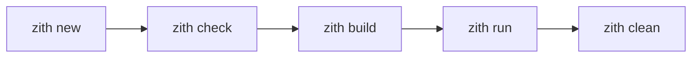

# CLI Reference

:::info Quick Navigation

Jump to specific commands:

- [`zith check`](./check.md) - Check code for errors
- [`zith compile`](./compile.md) - Compile to binary
- [`zith build`](./build.md) - Build project
- [`zith run`](./run.md) - Run program directly
- [`zith new`](./new.md) - Create new project
- [`zith fmt`](./fmt.md) - Format code

:::

## Overview

The Zith CLI provides all the tools you need to develop, build, and run Zith programs. Each command is designed to be intuitive and follow Unix conventions.

## Command Structure

All Zith commands follow this pattern:

```bash
zith <command> [options] [arguments]
```

### Global Flags

These flags work with all commands:

| Flag | Description | Default |
|------|-------------|---------|
| `--help`, `-h` | Show help message | - |
| `--version`, `-v` | Show version info | - |
| `--verbose` | Enable verbose output | `false` |
| `--config <path>` | Specify config file | `ZithProject.toml` |

## Available Commands

### Development Workflow



### Quick Reference Table

| Command | Purpose | Typical Use Case |
|---------|---------|------------------|
| [`new`](./new.md) | Create new project | Starting a fresh project |
| [`check`](./check.md) | Static analysis | Before committing code |
| [`compile`](./compile.md) | Generate binary | Production builds |
| [`build`](./build.md) | Full build pipeline | Development workflow |
| [`run`](./run.md) | Compile and execute | Quick testing |
| [`fmt`](./fmt.md) | Format code | Before commits |
| [`repl`](./repl.md) | Interactive shell | Experimentation |
| [`clean`](./clean.md) | Remove build artifacts | Cleanup |
| [`docs`](./docs.md) | Generate documentation | Building docs |

:::tip Pro Tip

Use `zith <command> --help` for detailed information about any command.

:::

## Next Steps

- Learn about individual commands in the sidebar
- Read about [global flags](./flags.md)
- Set up your [project configuration](../project/01-overview.md)
